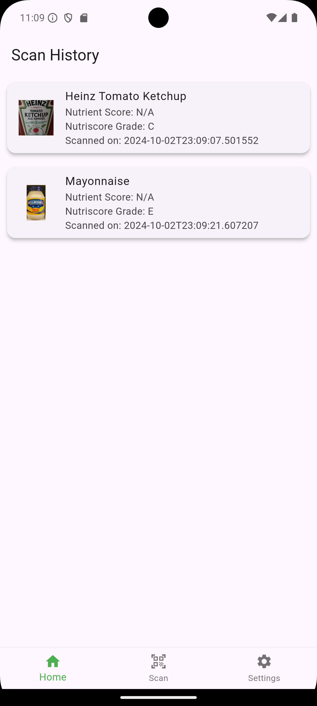
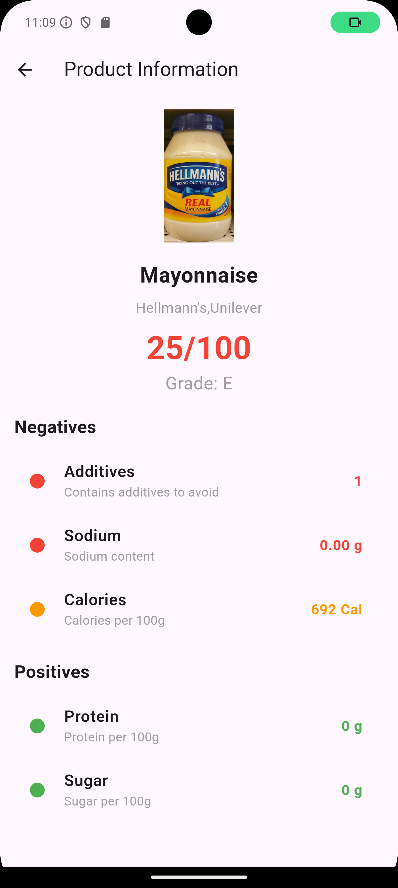
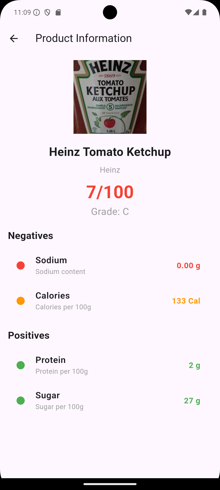

# EatSmart


EatSmart is a Flutter-based mobile application that helps users make smarter food choices by scanning product barcodes and providing detailed nutritional information. With a focus on promoting healthier eating habits, EatSmart is the perfect companion for anyone looking to monitor their diet and understand the contents of the food they consume.

## Features

- **Barcode Scanning:** Instantly scan product barcodes for quick nutritional data.
- **Nutritional Information:** Get a detailed breakdown of calories, macronutrients, and ingredients.
- **Product History:** View and manage a history of scanned products.
- **Health Score:** Receive a health rating for scanned food items.

## Screenshots





## Installation

1. Clone the repository:
   ```bash
   git clone https://github.com/JotWaraich/EatSmart.git
   ```
2. Navigate to the project directory:
   ```bash
   cd EatSmart
   ```
3. Install dependencies:
   ```bash
   flutter pub get
   ```
4. Run the app on an emulator or a physical device:
   ```bash
   flutter run
   ```

## Technologies Used

- **Flutter:** For building the mobile application.
- **Dart:** The programming language used for Flutter.
- **SQLite:** For storing scan history.
- **Supabase:** Backend service for managing user authentication and data.
- **Socket.IO/WebSockets:** For real-time communication (if applicable).

## Future Features

- File attachment in chats for scanned product information sharing.
- Integration with fitness apps for better dietary management.
- Offline scanning capabilities.

## License

This project is licensed under the MIT License - see the [LICENSE](LICENSE) file for details.

---

Built with 💡 by [Gurjagjot Singh Waraich](https://github.com/JotWaraich)
